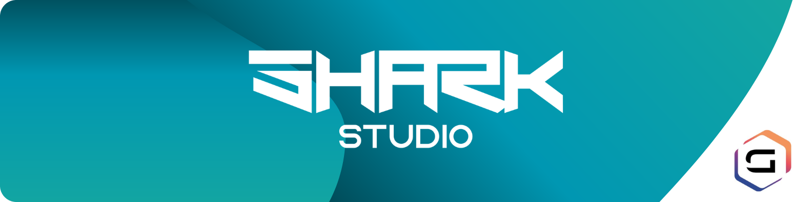

  

###

<h1 align="left">Love programming😮​? Me too! Let’s grab a drink🍻​!</h1>

###

Oh... I guess I need to introduce myself. Where do I even begin?  Alright, my name is Ethan. I'm just an average guy from France with a passion for programming and video games. I’m also deeply interested in all aspects of game development, especially the artistic ones.  I absolutely LOVE 3D animation, modeling, music production, sound design.. Basically, anything that brings virtual worlds to life and makes them more immersive.  Want to know more? Hmm, I think that’s enough text for now. Let me show you visually instead! :)

###

<h2 align="left">About me</h2>

###

✨ Creating bugs since 2016 🛠️​ Procedural tools addict 🎮​ Love playing Borderlands 2 🏎️​ Racing sim enjoyer 🚂​ In love with old choo-choos

###

  
  
  
  

